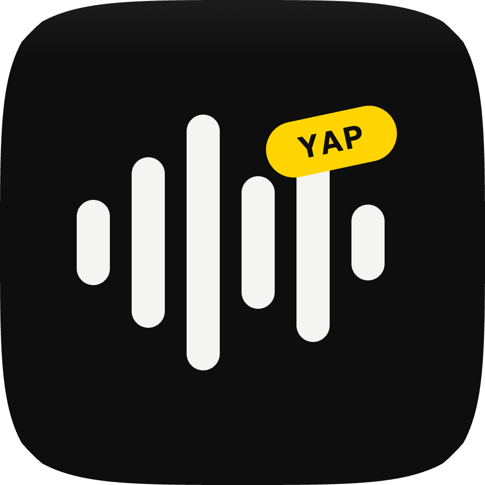

<p align="center">
  
</p>

<p align="center">
  <picture>
    <source media="(prefers-color-scheme: dark)" srcset="icon-pack/wordmark/wordmark-dark.png">
    
  </picture>
</p>

<p align="center">
  <b>Hold the globe key. Yap. Done.</b><br>
  Private, on-device dictation for macOS.
</p>

<p align="center">
  <a href="https://get-yapping.com"><b>get-yapping.com</b></a>
  &nbsp;&middot;&nbsp;
  <a href="https://github.com/angad-kandhari/yapping/releases/latest">Download</a>
</p>

<p align="center">
  
  
  
  
  
</p>

---

Hold the Globe (fn) key anywhere on your Mac, speak, release. Your words
appear at the cursor: filler words gone, punctuation fixed, meaning
untouched. Nothing leaves your machine. No cloud, no account, no
subscription, no word limits.

## Features

| | |
|---|---|
| **Hold to talk** | Press and hold fn; the logo dances above your Dock while you speak |
| **Hands-free** | Double-tap fn to talk without holding; tap, Esc, or silence finishes |
| **"Send it"** | End a dictation with the phrase and Return is pressed for you |
| **Zero-setup cleanup** | Apple's on-device model polishes transcripts out of the box; Ollama or any OpenAI-compatible endpoint if you prefer |
| **Styles per app** | Casual in Slack, formal in Mail, verbatim in terminals, terse prompt mode for AI assistants; every prompt editable |
| **Voice editing** | Select text, hold fn, say "make this more formal" |
| **Personal dictionary** | Your names, jargon, and acronyms bias recognition itself |
| **Transparent history** | Raw and cleaned text side by side; cleanup is never a black box |
| **On-screen context** | Reads the focused field locally so tone matches what you are writing |
| **Honest updates** | A real Updates window with release notes; checks only when you ask |
| **Transcribe files** | Audio and video files, many times faster than real time; menu or drag onto the icon |
| **Listen mode** | Transcribes what your Mac is playing: lectures, podcasts, the other side of calls |

## Install

Build from source (no Gatekeeper friction):

```bash
git clone https://github.com/angad-kandhari/yapping.git
cd yapping
make install
```

Or download the zip from [Releases](https://github.com/angad-kandhari/yapping/releases),
move Yapping.app to /Applications, and allow it once under System Settings,
Privacy and Security (releases are not notarized; the code is right here).

First launch opens a Setup Assistant that walks through the permissions
(Microphone, Input Monitoring, Accessibility) and the one system setting:
System Settings > Keyboard > "Press globe key to" > Do Nothing.

## Privacy

- Speech recognition: Apple SpeechAnalyzer, on-device
- Cleanup: Apple's on-device Foundation Model, or your own local Ollama
- Network connections: localhost, plus the GitHub API only when you click
  Check for Updates
- Dictations live only in a local history file you can clear any time;
  audio is never written to disk

## Project

- Website: [get-yapping.com](https://get-yapping.com)
- Contributing: [CONTRIBUTING.md](CONTRIBUTING.md)
- License: [Apache 2.0](LICENSE)

Built with SwiftPM and a Makefile. No Xcode project, no dependencies,
one small binary.
